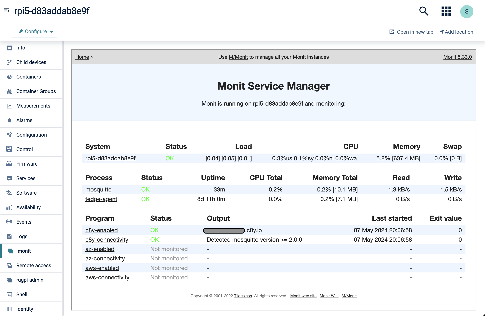

# tedge-monit-setup

Default monit configuration for thin-edge.io. It includes sensible monit defaults settings and enables/starts the related services.

This is a community driven repository where users are encouraged to create PRs to add support for any additional init system, or make changes to any of the existing definitions.

## Plugin summary

The following thin-edge.io customization is included in the plugin.

### What will be deployed to the device?

* install and configure monit with a localhost:2812 interface (see details below)
* enable/start the `monit` service

**Monit http web interface (http://localhost:2812)**

By default the web interface will be enabled, however it will only be accessible from on the device itself (as it will block any connection attempts from other devices for security reasons).

The monit UI can be accessed using the [cumulocity-remote-access-cloud-http-proxy](https://github.com/SoftwareAG/cumulocity-remote-access-cloud-http-proxy) extensions (UI and microservice) which enables you to access the monit web interface directly from the Cumulocity IoT Device Management UI by using the Cumulocity Cloud Remote Access Passthrough feature.

Below shows an example of the monit web interface access from Cumulocity IoT.




After installing the [cumulocity-remote-access-cloud-http-proxy](https://github.com/SoftwareAG/cumulocity-remote-access-cloud-http-proxy) UI plugin and microservice, the web interface can be accessed by creating a Remote Access Passthrough configuration with the following configuration:

|Configuration|Value|
|----|----|
|name|http:monit|
|type|PASSTHROUGH|
|host|127.0.0.1|
|port|2812|

**Note:** You may have to refresh the page before the "monit" tab will appear.


**Technical summary**

The following details the technical aspects of the plugin to get an idea what systems it supports.

|||
|--|--|
|**Languages**|`shell` (posix compatible)|
|**CPU Architectures**|`all/noarch`|
|**Supported init systems**|`systemd` and `init.d/open-rc`|
|**Required Dependencies**|-|
|**Optional Dependencies (feature specific)**|-|

### How to do I get it?

The following linux package formats are provided on the releases page and also in the [tedge-community](https://cloudsmith.io/~thinedge/repos/community/packages/) repository:

|Operating System|Repository link|
|--|--|
|Debian/Raspbian (deb)|[](https://cloudsmith.io/~thinedge/repos/community/packages/detail/deb/tedge-monit-setup/latest/a=all;d=any-distro%252Fany-version;t=binary/)|
|Alpine Linux (apk)|[](https://cloudsmith.io/~thinedge/repos/community/packages/detail/alpine/tedge-monit-setup/latest/a=noarch;d=alpine%252Fany-version/)|
|RHEL/CentOS/Fedora (rpm)|[](https://cloudsmith.io/~thinedge/repos/community/packages/detail/rpm/tedge-monit-setup/latest/a=noarch;d=any-distro%252Fany-version;t=binary/)|

## Features

The following features are supported by the plugin:

* Install and configure monit (using package dependencies)
* Install default rules to monit
    * Monitor cloud connections and perform reconnection if required (including collecting log files for debugging such disconnection events)
    * General device alerts like low disk space, high ram usage, file descriptor exhaustion etc.

## Settings

The plugin supports the following options which are controlled by editing the following configuration file:

**file: /etc/tedge-monit-setup/env**

```sh
# Where to write the log files to
LOG_DIR=/var/log/tedge-monit-setup

# Maximum number of days to keep log (tar.gz) files
MAX_DAYS=30

# Maximum number of log (tar.gz) files to keep
MAX_FILES=10
```

## Acknowledgements

[](https://cloudsmith.com)

Package repository hosting is graciously provided by  [Cloudsmith](https://cloudsmith.com).
Cloudsmith is the only fully hosted, cloud-native, universal package management solution, that
enables your organization to create, store and share packages in any format, to any place, with total
confidence.
